## A colorscheme for night dwellers

**Alfarroba** is based on [@snakedye's Chocolate theme](https://gitlab.com/snakedye/chocolate), and extended with more gray variants.

### Design Philosophy

The primary goals of Alfarroba are to:
- provide a comforting reading and editing experience
- remain relatively eye catching

### Palette

|                                                                       | Label    | Hex       | RGB                  | HSL                  |
| --------------------------------------------------------------------- | -------- | --------- | -------------------- | -------------------- |
|       | Red      | `#c65f5f` | `rgb(198, 95, 95)`   | `hsl(0, 52%, 58%)`   |
| 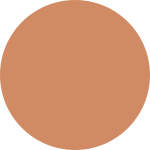   | Orange   | `#d08b65` | `rgb(208, 139, 101)` | `hsl(21, 52%, 61%)`  |
| 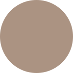    | Beige    | `#ab9382` | `rgb(171, 147, 130)` | `hsl(20, 24%, 59%)`  |
| 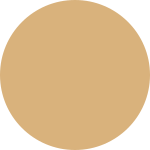   | Yellow   | `#d9b27c` | `rgb(217, 178, 124)` | `hsl(35, 56%, 67%)`  |
| 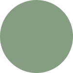    | Green    | `#859e82` | `rgb(133, 158, 130)` | `hsl(120, 17%, 56%)` |
| 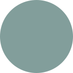     | Aqua     | `#829e9b` | `rgb(130, 158, 155)` | `hsl(174, 17%, 57%)` |
|      | Blue     | `#728797` | `rgb(114, 135, 151)` | `hsl(207, 21%, 52%)` |
| 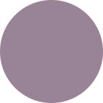   | Purple   | `#998396` | `rgb(153, 131, 150)` | `hsl(273, 13%, 55%)` |
| 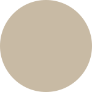     | Text     | `#c8baa4` | `rgb(200, 186, 164)` | `hsl(36, 22%, 72%)`  |
| 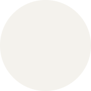 | Subtext0 | `#f4f2ed` | `rgb(244, 242, 237)` | `hsl(36, 25%, 94%)`  |
| 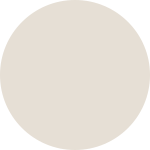 | Subtext1 | `#e6dfd5` | `rgb(230, 223, 213)` | `hsl(36, 25%, 87%)`  |
| 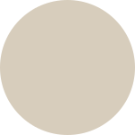 | Subtext2 | `#d7cdbc` | `rgb(215, 205, 188)` | `hsl(36, 23%, 79%)`  |
|  | Surface0 | `#302c2b` | `rgb(48, 44, 43)`    | `hsl(5, 7%, 18%)`    |
|  | Surface1 | `#3d3837` | `rgb(61, 56, 55)`    | `hsl(5, 6%, 23%)`    |
| 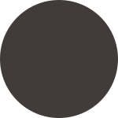 | Surface2 | `#413c3a` | `rgb(65, 60, 58)`    | `hsl(5, 6%, 24%)`    |
| 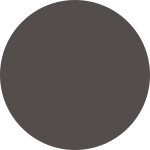 | Overlay0 | `#534e4c` | `rgb(83, 78, 76)`    | `hsl(9, 5%, 31%)`    |
| 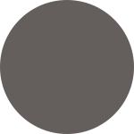 | Overlay1 | `#645f5d` | `rgb(100, 95, 93)`   | `hsl(9, 5%, 38%)`    |
| 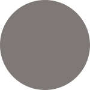 | Overlay2 | `#7e7876` | `rgb(126, 120, 118)` | `hsl(9, 3%, 48%)`    |
| 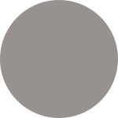 | Overlay3 | `#979290` | `rgb(151, 146, 144)` | `hsl(9, 2%, 58%)`    |
| 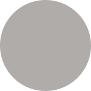 | Overlay4 | `#b0acaa` | `rgb(176, 172, 170)` | `hsl(9, 2%, 68%)`    |
|      | Base     | `#252221` | `rgb(37, 34, 33)`    | `hsl(5, 6%, 14%)`    |
|    | Mantle   | `#141110` | `rgb(20, 17, 16)`    | `hsl(13, 11%, 7%)`   |
|     | Crust    | `#080504` | `rgb(8, 5, 4)`       | `hsl(22, 33%, 2%)`   |

### Contributing

If you would like to port Alfarroba to unsupported programs, feel free to create a PR submitting your contribution.

### Ports

Alfarroba has currently been ported to the following programs:
- [Ghostty]()
- [Helix]()

